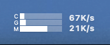

# LState 设计稿

这是一个核心功能为在状态栏展示设备信息的工具

## 功能点

核心点，在于状态栏的图标，通过自定义的绘制，以此在状态栏直接展示最直观的状态数据

### 状态栏

状态栏中，将会以折线图的形式，展示 CPU、GPU、内存的占用情况。

### 信息窗口

点击状态栏图标后，将会展示信息气泡。

信息气泡里，将会详细展示 CPU、GPU、内存、网络的参数信息，以及相关的性能的占比。

